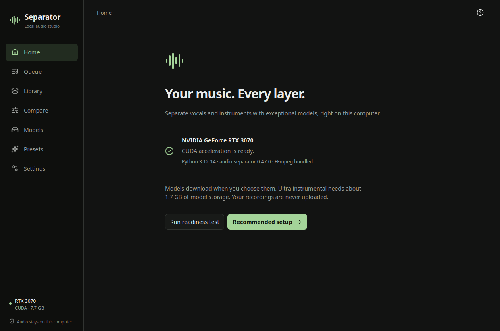

# Separator

A native desktop studio for high-quality, local audio separation. Built with Tauri 2, React, Rust and a private Python processing runtime. Your recordings stay on your computer.

Drop a recording, choose a layer and quality, separate, then listen and export. Studio mode exposes individual models, compatible ensembles, algorithm/weight selection and inference controls. The persistent queue runs GPU jobs serially; cancellation terminates only the application's processing worker.

## Quality comes first

Ultra instrumental uses **Inst v1e+ + Becruily** with upstream `uvr_max_spec`. Ultra vocals uses **Resurrection + Big Beta6x** with `avg_fft`. All four requested checkpoints remain selectable individually. These are real `python-audio-separator` ensembles, preserving each model's context defaults and float intermediates.

Both Ultra ensembles were executed successfully on an RTX 3070 with 8 GB VRAM, in float32. The synthetic integration fixture verifies execution, file validity, timing and hardware use; it does **not** prove universal perceptual superiority. [Model research and selection](docs/research.md) explains the source evidence and successors.

## Install

Installable packages are generated by [Desktop packages](https://github.com/Elias02345/UltimateAudioTools-GUI/actions/workflows/packages.yml): Windows x64 NSIS, Linux x64 AppImage/deb, and Apple Silicon macOS 14+ DMG. Tagged releases appear in [Releases](https://github.com/Elias02345/UltimateAudioTools-GUI/releases).

The complete installer includes Python, CPU/MPS PyTorch, the engine and FFmpeg. Users do not need a terminal, Python, pip or Docker. Model weights download when selected; the four default weights total about 3.5 GB. Their individual licenses are not specified by the publishers and the app does not bundle or relabel them.

Windows/Linux NVIDIA users can install a hash-verified private CUDA runtime from Setup or Settings. CUDA 13 requires an NVIDIA driver R580 or newer and 20 GB free space during the upgrade. The installer never changes system Python or drivers. CPU processing remains available.

Intel macOS, AMD DirectML and MLX are not advertised as verified providers. The current Apple target uses the supported PyTorch MPS path; see [platform evidence](docs/STATUS.md).

## In the studio

- Import multiple files or folders; WAV, FLAC, MP3, M4A, OGG and other FFmpeg formats.
- Fast, Balanced and Ultra recommendations, plus four-stem Demucs and custom presets.
- Persistent queue, pause after current, reorder, cancel, retry and searchable history.
- Model search/download/cancel/integrity checks and explicit cache management.
- Lossless FLAC/WAV or MP3/OGG/M4A export; original or selected sample rate, ceiling, safe names and collision policy.
- Synchronized original/stem listening, waveform seek, mute/solo, volume, zoom, loop and blind comparisons over matching ranges.
- Local diagnostics, readiness tests, light/dark/system themes and reduced motion.

Presets, settings, history and model weights live outside the installation directory. Clearing processing caches never deletes exported recordings. [Data and update contract](docs/UPDATE_RULES.md).

For development and validation, see [BUILDING.md](BUILDING.md), [CONTRIBUTING.md](CONTRIBUTING.md) and [ARCHITECTURE.md](ARCHITECTURE.md). App source is MIT; [third-party notices](THIRD_PARTY_NOTICES.md) apply separately.
